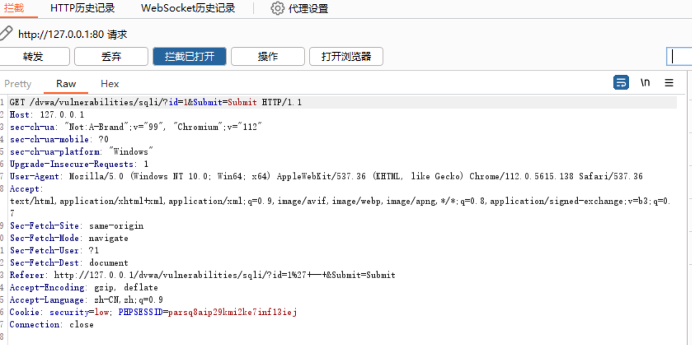
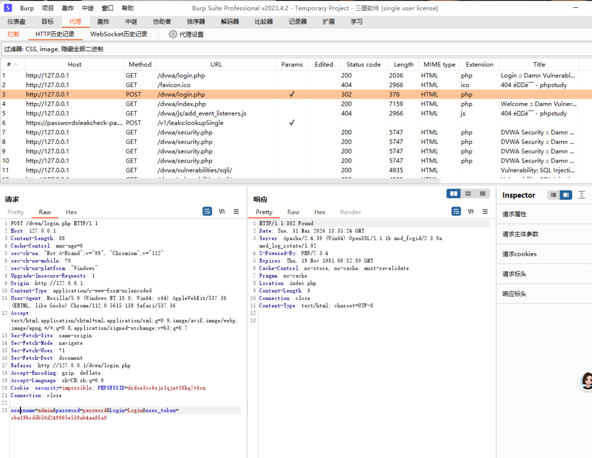
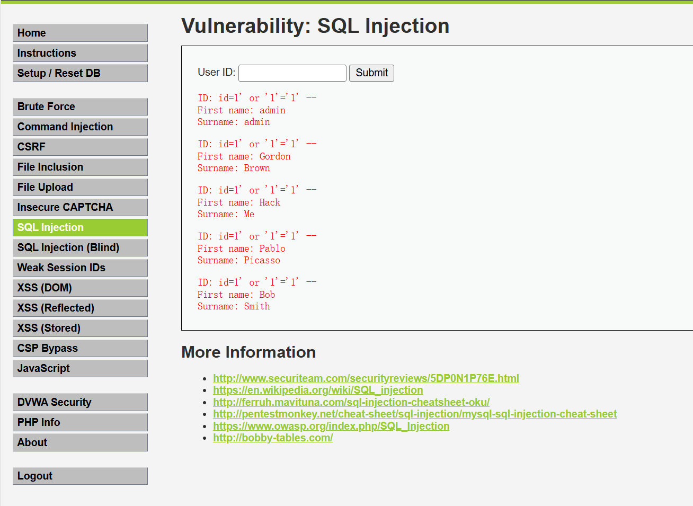

# **SQL 注入深度理解（DVWA Low）**
##(3.30-3.31)

### 一、漏洞原理
为什么输入 `1' or '1'='1' -- ` 会返回所有数据？
输入 `1' or '1'='1' -- ` 后，后台实际执行的 SQL 语句变成：```sql
SELECT first\_name, last\_name FROM users WHERE user\_id = '1' or '1'='1' -- '

解释：
1. 1' 闭合了原来的单引号
2. or 是“或”逻辑，两边只要有一个为真，整个条件就为真
3. '1'='1' 是永真条件（字符串1永远等于字符串1）
4. \-- 注释掉了后面多余的代码
5. 因为 or '1'='1' 永远为真，所以 WHERE 条件永远成立，数据库返回了 users 表中的所有数据。


### 二、HTTP 知识回顾

GET 和 POST 的区别：
GET：请求指定的资源，参数放在 URL 后面（如 ?id=1）
POST：向服务器提交数据（如登录），参数放在请求体中
状态码 302 的含义：资源临时被移到了另一个 URL，登录成功后，服务器返回 302，告诉浏览器“去首页吧”


### 三、Burp 抓包验证

1\. 抓登录包的操作步骤：

* 打开 Burp，确保 Proxy → Intercept 中的拦截开关是 Intercept is on（红色状态）
* 在浏览器中设置代理为 127.0.0.1:8080，或用 Burp 自带的 Open Browser
* 访问 DVWA 登录页面 http://127.0.0.1/dvwa/login.php
* 输入用户名 admin 和密码 password，点击 Login
* Burp 会拦截到请求，第一行是 POST /dvwa/login.php HTTP/1.1
* 在 Raw 视图里往下翻，可以看到请求体中的 username=admin\&password=password
* 右键点击请求 → 发送到 Repeater，可以反复修改和发送




2\. 改 SQL 注入参数的操作步骤：

* 确保 Burp 拦截开关是 Intercept is on
* 进入 DVWA 的 SQL Injection 页面
* 输入 1，点击 Submit
* Burp 会拦截到一个 GET 请求（参数在 URL 里）
* 在请求的 URL 中找到 id=1，改成 id=1' or '1'='1' --
* 点击 Forward 放行
* 浏览器返回多个用户的信息（admin、gordonb、1337、pablo、smithy）



### 四、核心收获

1. SQL 注入的本质是改变原 SQL 语句的逻辑
2. 单引号 ' 用于闭合字符串，让原本的 SQL 语句结构被打破
3. or '1'='1' 构造恒真条件，让 WHERE 永远为真
4. \-- 用于注释掉后面多余的代码（注意 -- 后面有空格）
5. GET 参数在 URL，POST 参数在请求体
6. Burp 可以拦截并修改任何请求，绕过前端限制

### 五、待解决问题

1\. Burp 抓包时总出现系统后台请求怎么办？

问题表现：拦截到的第一个请求经常是 ipv6.msftncsi.com 或类似地址，不是 DVWA 的请求。
原因：Windows 系统会在后台自动发送网络连通性测试，这些请求也会经过代理。
解决办法：
把这些系统请求点 Forward 放行，直到出现 DVWA 的请求
或者直接关闭拦截（Intercept is off），访问完 DVWA 后在 HTTP 历史记录里找登录请求


2\. 为什么登录请求是 POST，而 SQL 注入请求是 GET？
POST 用于向服务器提交数据（如用户名密码），参数放在请求体中
GET 用于向服务器请求页面，参数拼在 URL 后面
DVWA 的 SQL Injection 模块用的是 GET 方式，所以参数在 URL 里

3\. 在 Burp 里修改参数时，-- 后面的空格重要吗？
重要。SQL 中 -- 是注释符，但必须后面跟一个空格才能生效。在 Burp 里修改时，记得在 -- 后面敲一个空格。

4\. Burp 的 Intercept 开关和 HTTP 历史记录有什么区别？
Intercept is on：请求会被拦住，必须手动点 Forward 或 Drop，适合精细修改单个请求
HTTP 历史记录：无论拦截开关是开还是关，所有经过代理的请求都会被记录下来，适合事后查看

